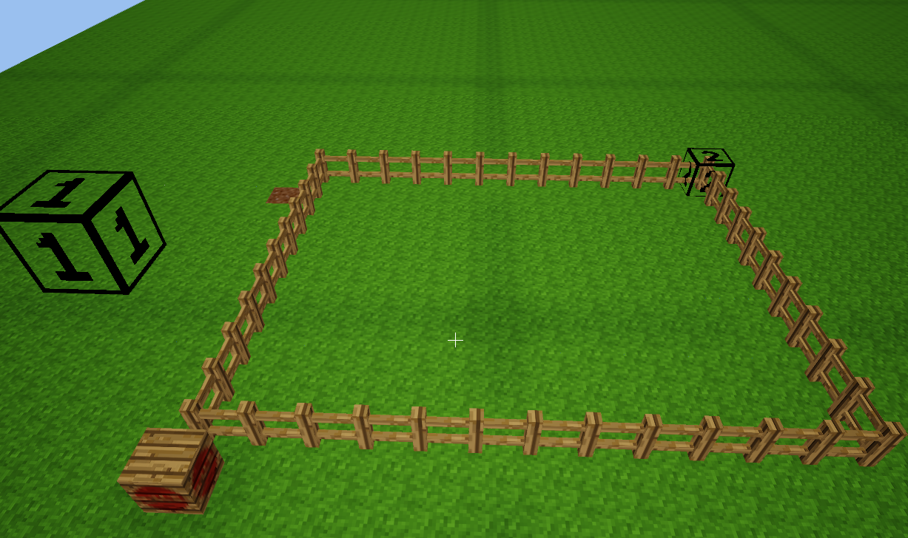
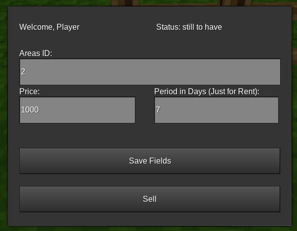
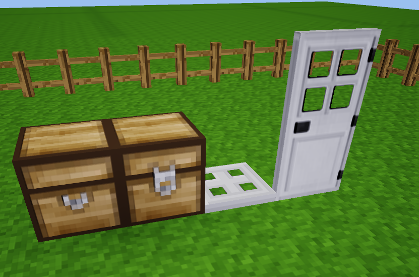
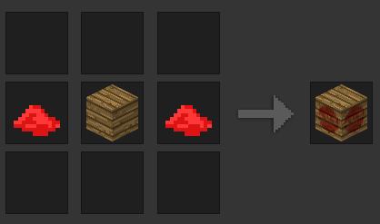

# Minetest Mod: Areas Pay
With this mod you can rent and buy areas in minetest.

## Required Mods:
- Areas Mod: from https://github.com/minetest-mods/areas
- Jeans Teleportation from https://github.com/Jean28518/jeans_economy
- WorldEdit: https://github.com/Uberi/Minetest-WorldEdit

This mod doenst change any behavior of some of the above mods.

## Features:
- Rent Areas for a specific amount of time very fast and uncomplicated
- Areas can only rented 2 periods in the future by an customer (Can be configured easy)
- Sell Areas very easy
- After a rented Area becomes available again, Chests, LockedDoors, etc. are automaticly removed

## Configuration:
In the init.lua file you are able to add more blocks, which should be removed after an area becomes available again. It is the variable ```BLOCKS_TO_REMOVE```. You can empty this table, if you want to deactivate this feature.

Also you can change the update time of the mod. It is the Period, in it every rented area is been checked, if it is valid. With ```MAX_RENT_PERIODS``` you can define, how many periods the customer can buy at once.

## Screenshots:
### Example Plot:


### Owner View:


### Customer View:


### These Items will be automaticly removed after the rent time is up:



### Crafting Recipe:

